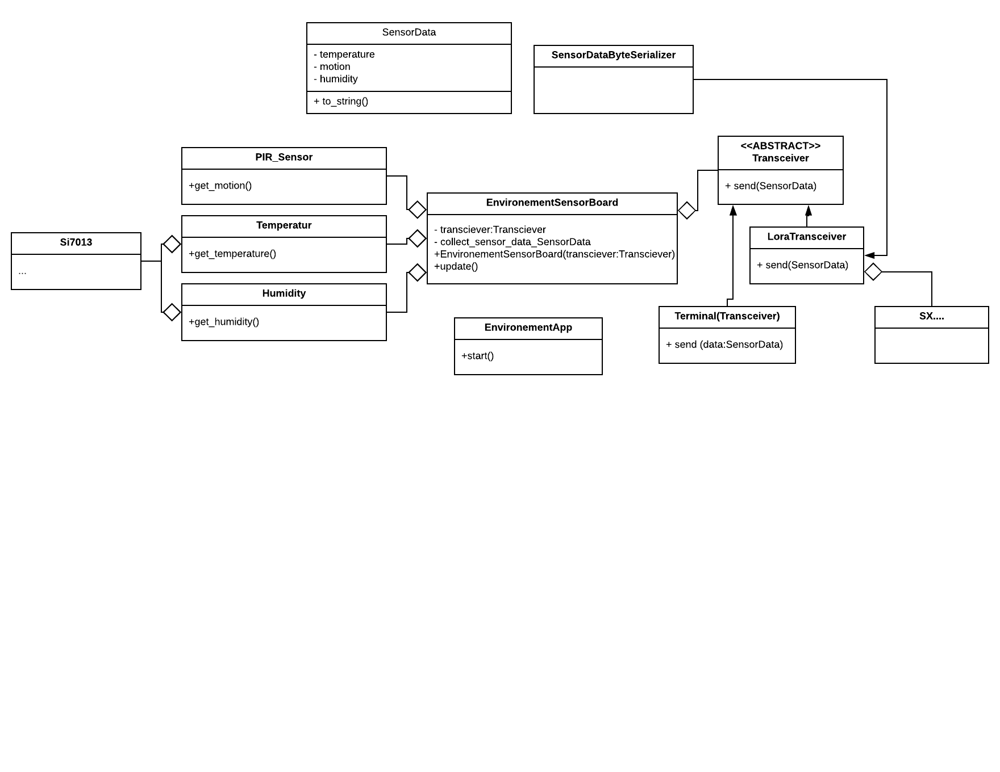

# Project Smart-Campus - Firmware
This is the firmware for a environment Sensor Board for the project Smart-Campus created by University College VIVES campus Bruges.


## Setting up the project
Next we need to download the libraries:

```shell
mbed deploy
```

Now setup the project to compile for example for the LPC1768 by editing the `.mbed` file and adding the following to it (this can also be done automatically using the mbed detect command if you have an mbed connected):

```
ROOT=.
TOOLCHAIN=GCC_ARM
TARGET=LPC1768
```

Last we need to enable C++11 compilation. THis can be achieved by changing the three json configurations files in `code/mbed-os/tools/profiles`. Change the `cxx` section of the `GCC_ARM` config to the following:

```json
        "cxx": ["-std=gnu++11", "-fno-rtti", "-Wvla"],
```

## Adding libraries

If you add other libraries, please only add the `.lib` file to the repository and add the actual library directory to the `code/.gitignore` file. Take a look inside the file for an example.

---

# Example LoRaWAN application for Mbed-OS

This is an example application based on `Mbed-OS` LoRaWAN protocol APIs. The Mbed-OS LoRaWAN stack implementation is compliant with LoRaWAN v1.0.2 specification. 

## Getting started

This application can work with any Network Server if you have correct credentials for the said Network Server. 

### Download the application

```sh
$ mbed import mbed-os-example-lorawan
$ cd mbed-os-example-lorawan

#OR

$ git clone git@github.com:ARMmbed/mbed-os-example-lorawan.git
$ cd mbed-os-example-lorawan
$ mbed deploy
```
### Add network credentials

Open the file `mbed_app.json` in the root directory of your application. This file contains all the user specific configurations your application and the Mbed OS LoRaWAN stack need. Network credentials are typically provided by LoRa network provider.

#### For OTAA

Please add `Device EUI`, `Application EUI` and `Application Key` needed for Over-the-air-activation(OTAA). For example:

```json

"lora.device-eui": "{ YOUR_DEVICE_EUI }",
"lora.application-eui": "{ YOUR_APPLICATION_EUI }",
"lora.application-key": "{ YOUR_APPLICATION_KEY }"
```

#### For ABP

For Activation-By-Personalization (ABP) connection method, modify the `mbed_app.json` to enable ABP. You can do it by simply turning off OTAA. For example:

```json
"lora.over-the-air-activation": false,
```

In addition to that, you need to provide `Application Session Key`, `Network Session Key` and `Device Address`. For example:

```json
"lora.appskey": "{ YOUR_APPLICATION_SESSION_KEY }",
"lora.nwkskey": "{ YOUR_NETWORK_SESSION_KEY }",
"lora.device-address": " YOUR_DEVICE_ADDRESS_IN_HEX  " 
```

## Configuring the application

The Mbed OS LoRaWAN stack provides a lot of configuration controls to the application through the Mbed OS configuration system. The previous section discusses some of these controls. This section highlights some useful features that you can configure.

## Compiling the application

Use Mbed CLI commands to generate a binary for the application.
For example:

```sh
$ mbed compile -m YOUR_TARGET -t ARM
```

## Running the application

Drag and drop the application binary from `BUILD/YOUR_TARGET/ARM/mbed-os-example-lora.bin` to your Mbed enabled target hardware, which appears as a USB device on your host machine. 

Attach a serial console emulator of your choice (for example, PuTTY, Minicom or screen) to your USB device. Set the baudrate to 115200 bit/s, and reset your board by pressing the reset button.

You should see an output similar to this:

```
Mbed LoRaWANStack initialized 

 CONFIRMED message retries : 3 

 Adaptive data  rate (ADR) - Enabled 

 Connection - In Progress ...

 Connection - Successful 

 Dummy Sensor Value = 2.1 

 25 bytes scheduled for transmission 
 
 Message Sent to Network Server

```

# UML diagram
